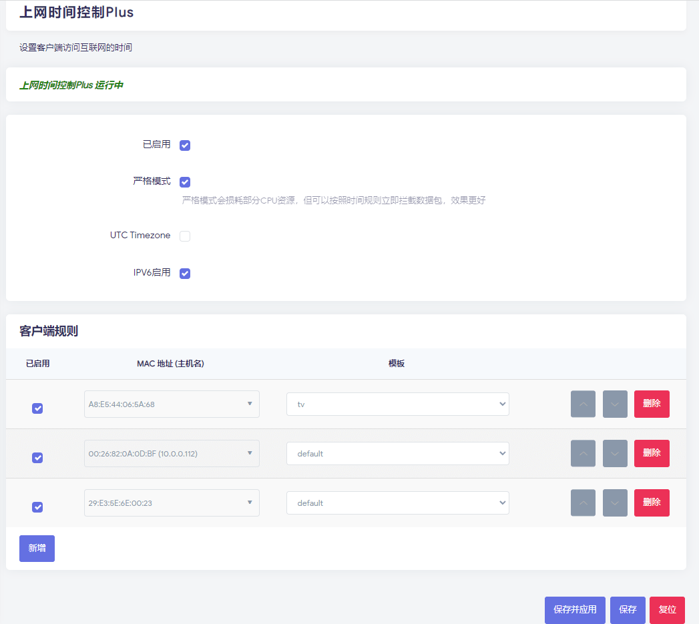

Openwrt 上网时间控制控件Plus

特点：精准控制网络设备上网时间

**规则模板**

可以设定多套模板，每天模板对应多个上网时间规则

**绑定网卡物理地址**

采用绑定网卡物理和模板规则

**支持本地时区**

支持本地时区和UTC标准时间设定。按照本地市区设定，不再需要换算时间。

**无需设定黑名单**

已经启用上网控制的网卡物理地址，自动进入防火墙过滤，非使用时间自动过滤。

**本插件需要安装以下库**

请检测是否已安装 snmpd iptables kmod-ipt-nat kmod-nf-nat

如需要支持ipv6请安装 ip6tables

同时需要安装网络基础组件

**感谢**

coolsnowwolf

本插件基于大神版本修改
https://github.com/coolsnowwolf/luci/tree/master/applications/luci-app-accesscontrol

软件安全无毒，请放心下载使用

感谢您的支持，遇到问题可以反馈

